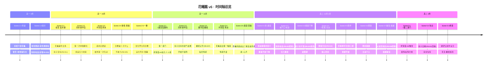
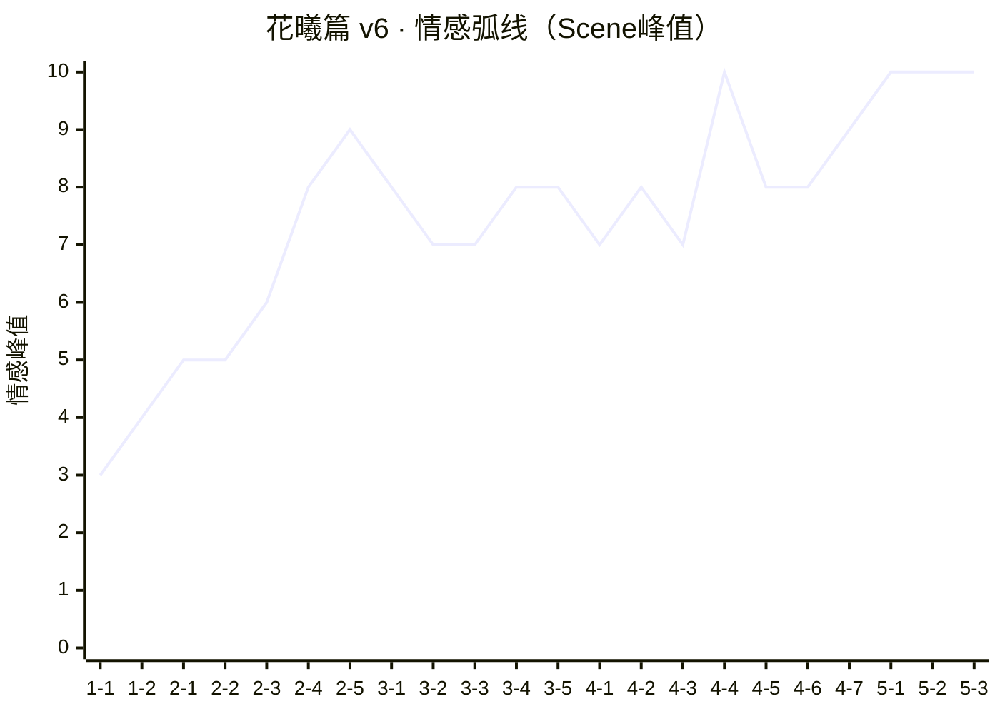
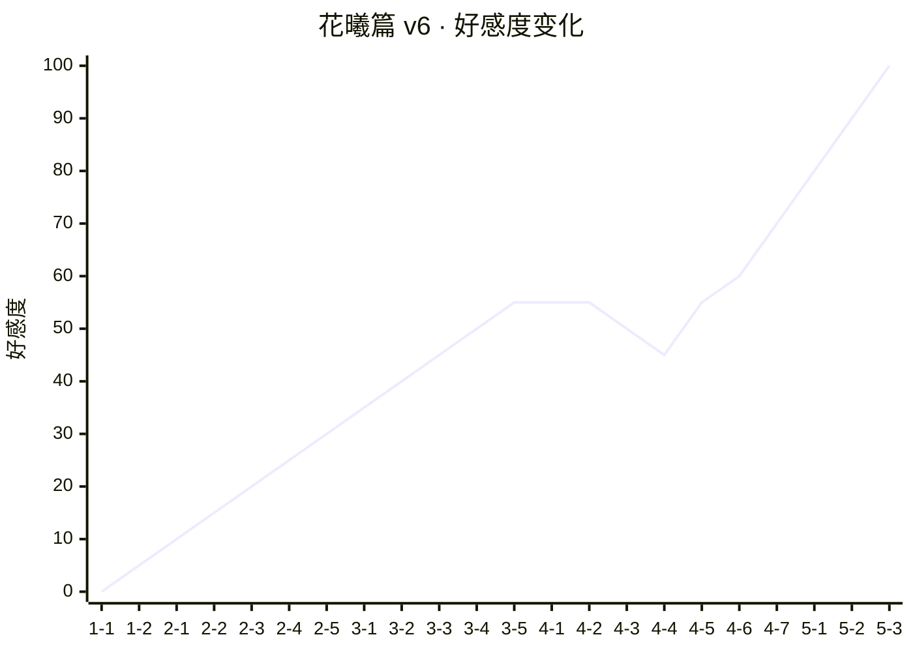
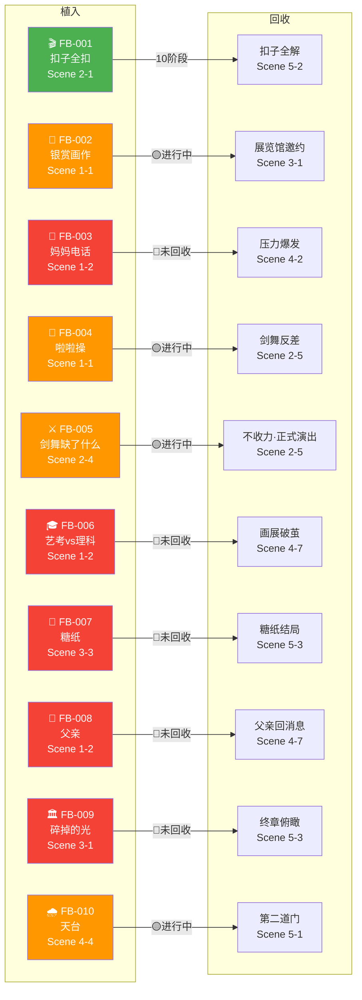
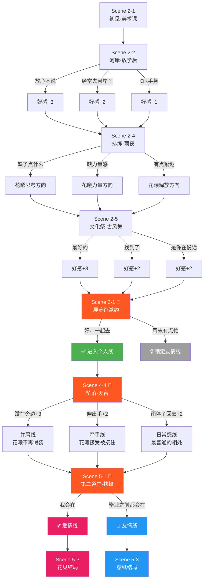
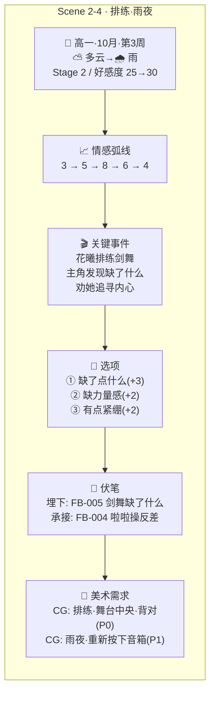

# 花曦篇 v6 · 剧情可视化时间线

> 使用Mermaid语法绘制，VS Code/GitHub/Trae原生渲染
> 包含：时间轴、关键事件、情感弧线、伏笔轨迹、选项分支、好感度变化

---

## 一、总览时间线（全局视图）

---

## 二、情感弧线图（数值化）

> ⚠️ 强制规则：每个Stage的情感峰值必须递增
> Stage 1-2峰值：4-6 → Stage 3峰值：6-8 → Stage 4峰值：7-10 → Stage 5峰值：8-10

---

## 三、好感度变化图

> 🚪 第一道门(3-1)：好感度≥40 → 🚪 第二道门(5-1)：好感度≥60
> 4-3~4-4 好感度下降（能量下降+天台危机），4-5后回升

---

## 四、伏笔轨迹图

> 图例：🟢已回收 / 🟡进行中 / 🔴未回收

---

## 五、选项分支图

---

## 六、Stage阶段视图（单Scene详情模板）

> 以下模板用于展示单个Scene的完整信息，创作完成后填写

---

## 七、使用说明

### 如何维护

1. **创作新Scene后**：更新总览时间线 + 情感弧线图 + 好感度图
2. **伏笔变化时**：更新伏笔轨迹图的颜色（🔴→🟡→🟢）
3. **选项修改时**：更新选项分支图
4. **总编评审时**：对照情感弧线图验证峰值递增

### 如何查看

- **VS Code/Trae**：安装Mermaid预览插件，直接渲染
- **GitHub**：原生支持Mermaid渲染
- **导出**：可使用mermaid-cli导出为PNG/SVG

### 后续扩展

- 多角色线叠加：在总览时间线中增加文陆/禾昭/于桦的section
- 跨线联动：用虚线标注不同角色线的时间交叉点
- Web交互页面：用mermaid.js渲染，添加点击交互
